# 班集项目

> ### 需要交流学习的可以添加我QQ:1321366271

如果您感觉我的笔记帮助到了您，那么您可以选择扫描下方的赞赏码请笔者喝杯咖啡！

## 主要功能如图所示

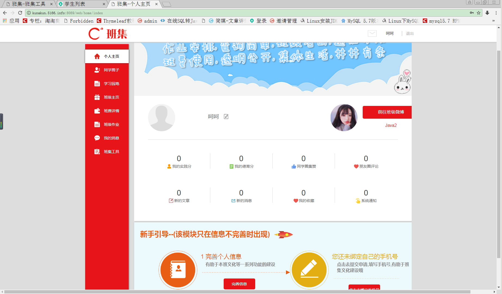

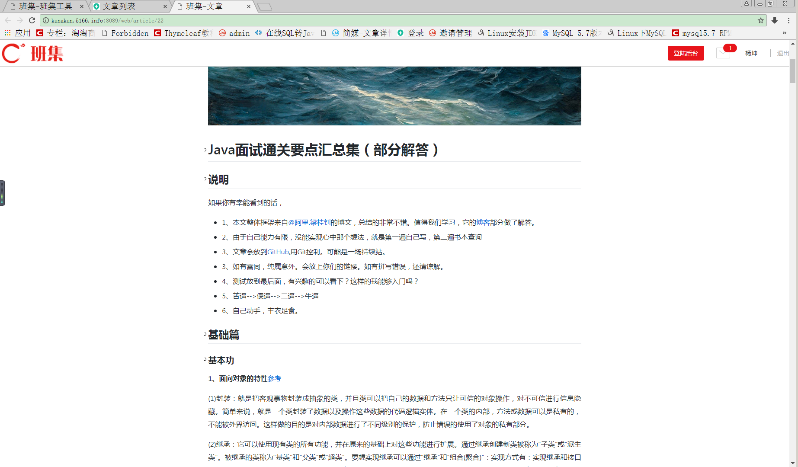

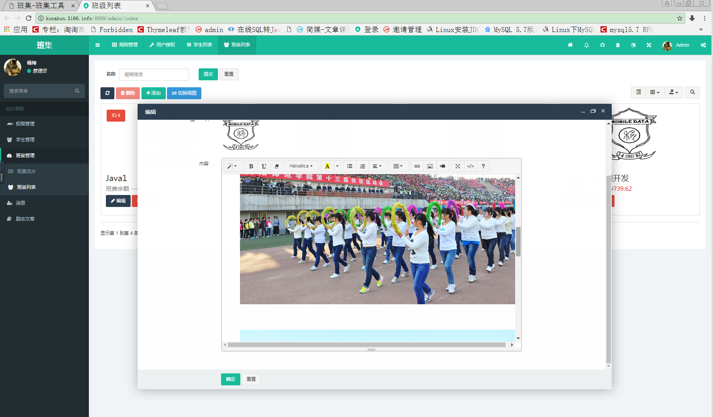

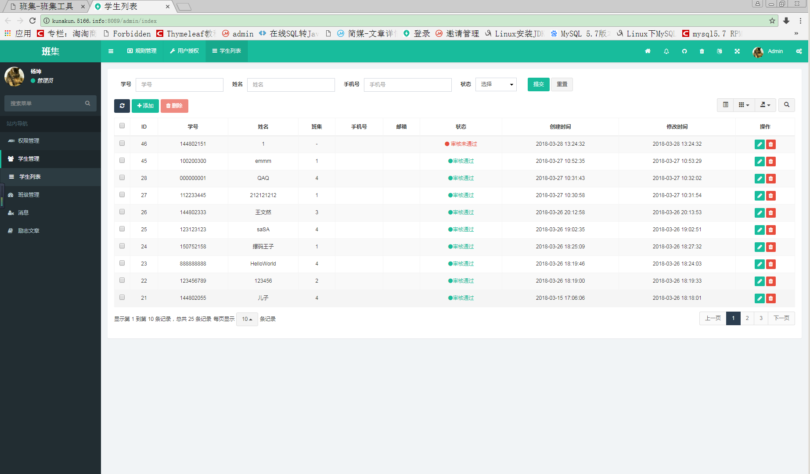

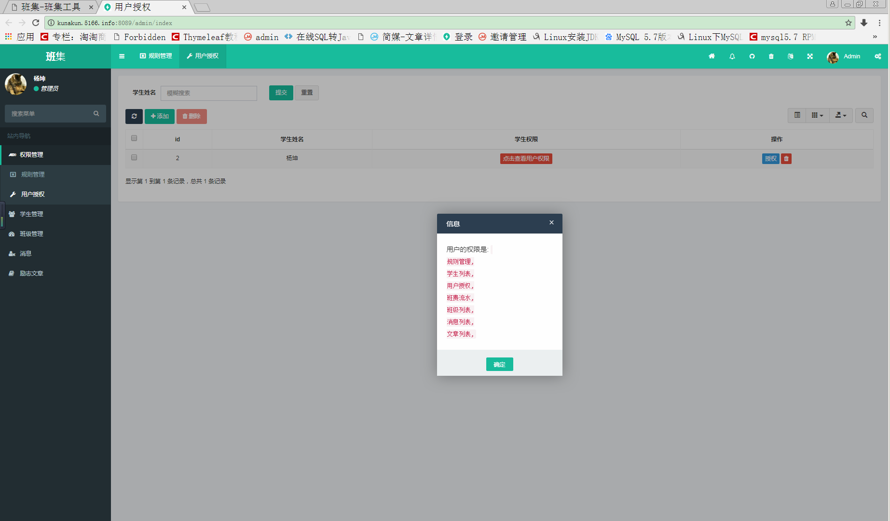

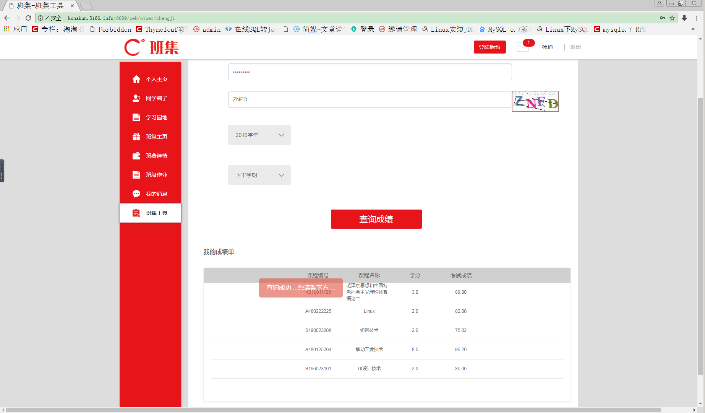

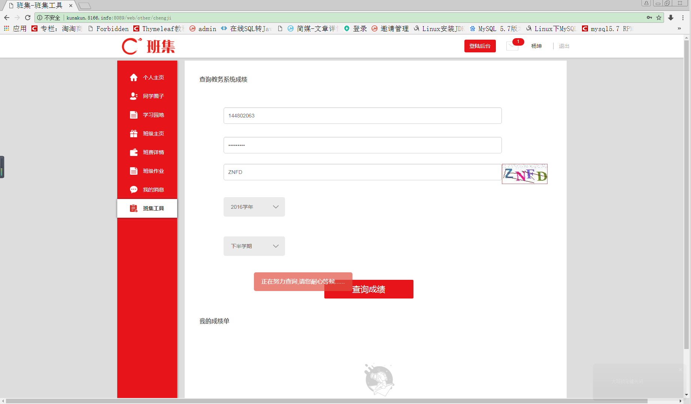

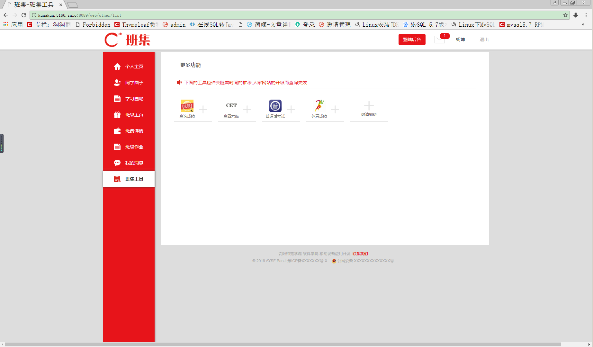

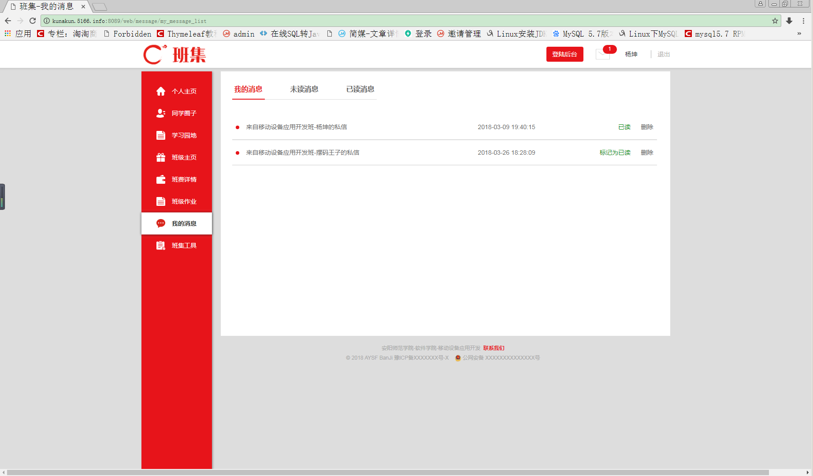

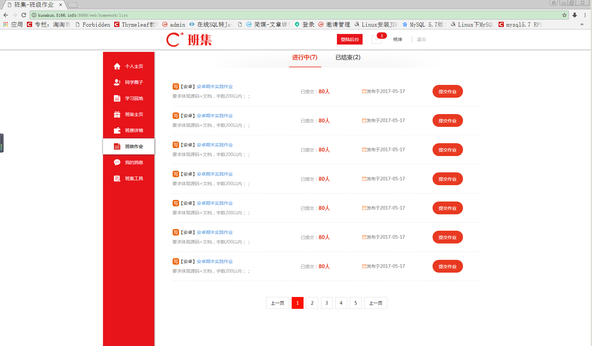

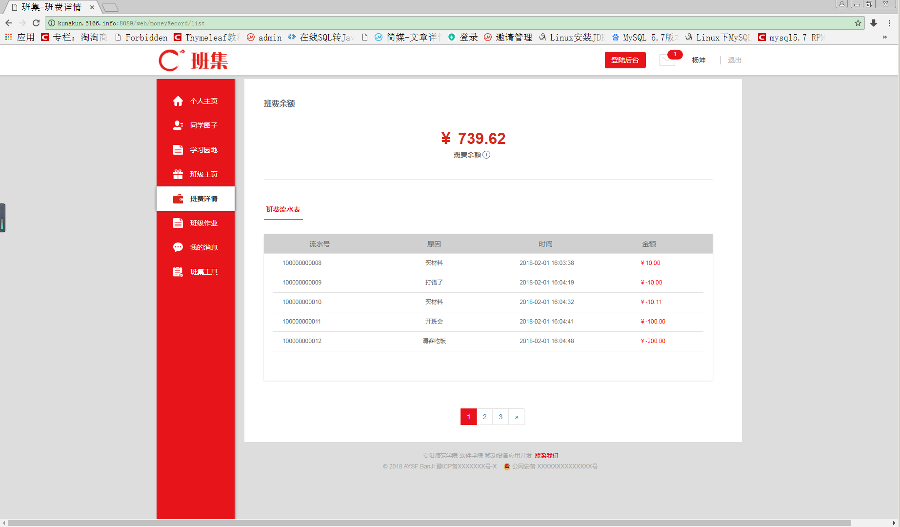

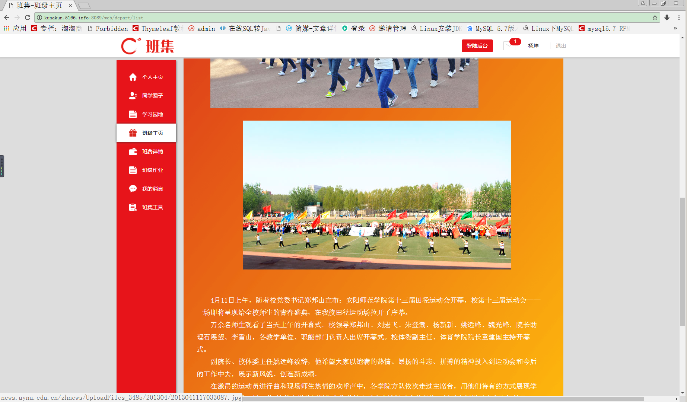

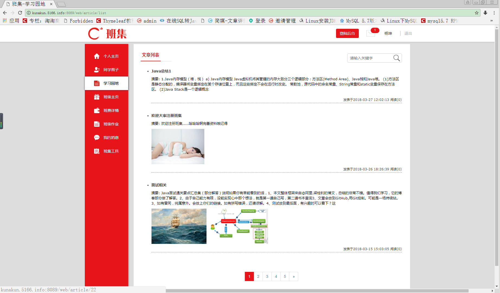

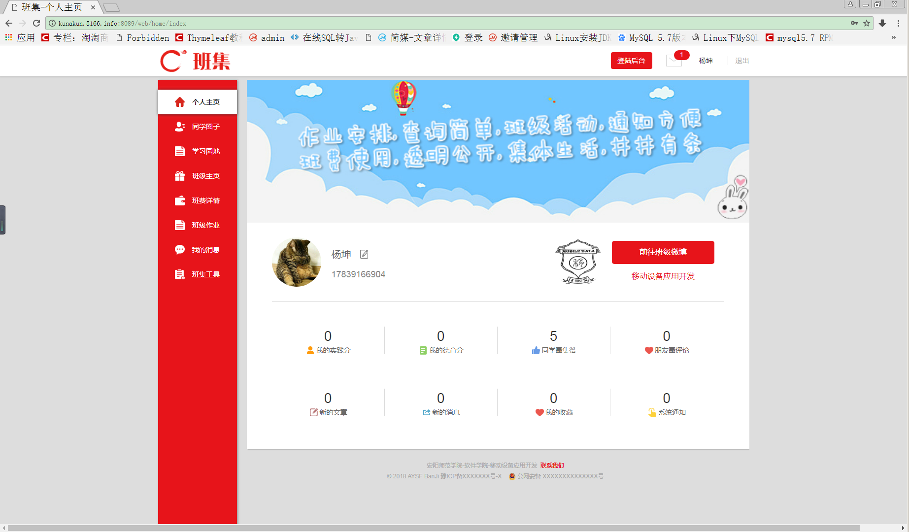

## 技术点：

1. springboot
2. solr
3. redis
4. rabbitmq
5. asynhttpclient
6. mybatis
7. mysql

微信赞赏码

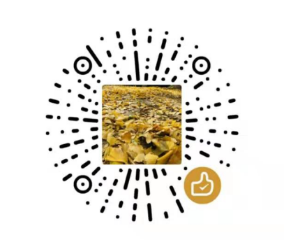

支付宝赞赏码

Thank You！